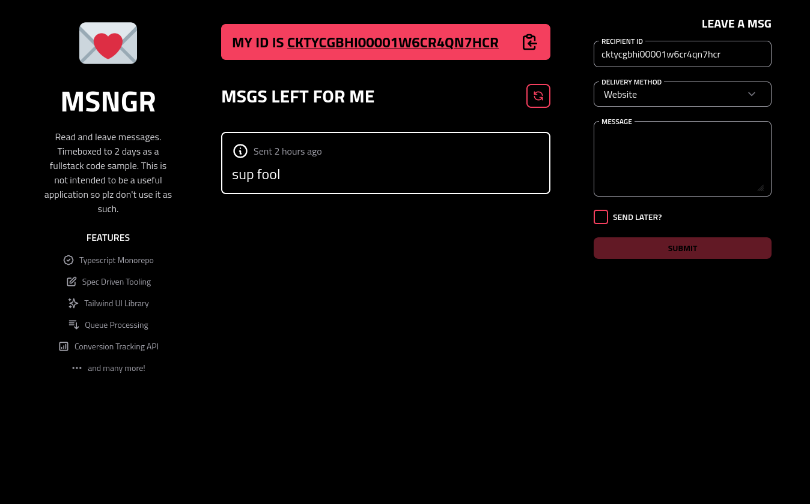

<h1 align="center">
  
</h1>

- [Fullstack Sample](#fullstack-sample)
  - [Structure](#structure)
  - [Notable API's](#notable-apis)
    - [Separation of concerns as internally consumed packages](#separation-of-concerns-as-internally-consumed-packages)
    - [OpenAPI Tooling](#openapi-tooling)
    - [Custom React Component Library w/ TailwindCSS](#custom-react-component-library-w-tailwindcss)
    - [Server Side Conversion Tracking](#server-side-conversion-tracking)
  - [Dependencies](#dependencies)
  - [Recommended VSCode Extensions](#recommended-vscode-extensions)
  - [Getting Started](#getting-started)
    - [Local Development](#local-development)
    - [Cleaning Up](#cleaning-up)
    - [Updating Internal Packages](#updating-internal-packages)
    - [Continuous Deployment](#continuous-deployment)
  - [Prisma / Base System Datamodel](#prisma--base-system-datamodel)
    - [Migrations](#migrations)

# Fullstack Sample

> A quick and dirty timeboxed fullstack application. Please note that this is not intended to be a "complete" application, moreso a demonstration of proficiency with modern fullstack tooling and application design.



## Structure

```sh
# The root entrypoint to the website monorepo, contains orchestration scripts and dev dependencies.
├── package.json
│   # Defines, mysql and redis services
├── docker-compose.yml
│   # Internally consumed packages imported by public facing services
├── packages
│   │   # A React component library for TailwindCSS
│   ├── components
│   │   # Cypress e2e tests
│   ├── e2e
│   │   # TS Library defining application events and conversion statuses
│   ├── events
│   │   # OpenAPI spec and codegen'd API client for consumption in production applications
│   ├── message-client
│   │   # TS Service implementing ^ OpenAPI spec, and queue management for delivering messages
│   ├── message-server
│   │   # Custom TailwindCSS theme for consumption by component library and web service
│   ├── tailwind
│   │   # Next.js application and serverless API
│   ├── web
│   │   │   # Contains prisma schema and migrations
│   │   ├── prisma
```

## Notable API's

These are a few areas I'd like to draw your attention to as you peruse the codebase.

### Separation of concerns as internally consumed packages

I really enjoy working in Typescript monorepos, and tooling like [pnpm](https://pnpm.io/), lerna, yarn, etc. has made it extremely easy to break out applications into their smallest parts so they can be iterated on, built, versioned, tested, and published independently to their consumers.

A pattern I've found that works well is that every package has at minimum the following `npm-scripts` interface to allow for maximum interoptibility with the aforementioned tooling:

```json
{
  "scripts": {
    "clean": "removes build artifacts and any caches, rm -rf",
    "build": "create a production build",
    "dev": "watch files and/or start a dev server that rebuilds when files are modified",
    "start": "if applicable, run the artifact created via `build` as if it was a production environment"
  }
}
```

This interface allows for batch and recursive workflows to be managed from the root of the monorepo with simple commands, so if we wanted to build the entire monorepo, we would run `lerna run build` or `pnpm run build --recursive`

Additionally, development workflows are made especially trivial. For example, if I wanted to develop the web application, and any dependencies that happened to be local to the monorepo, like `components`, `events`, and `message-client`, all I would have to do is run `lerna run dev --scope web --include-dependencies --parallel`

### OpenAPI Tooling

I believe strongly in good documentation, and that when we write code, our users aren't just people that consume a web UI, but our coworkers and peers. We as developers show respect by maintaining good documentation, and if our documentation adheres to a structured spec, like GraphQL or OpenAPI, our code itself can be derived from our documentation.

For example, I've documented a REST API in OpenAPI in [/packages/message-client/openapi.yaml](/packages/message-client/openapi.yaml). By itself, a spec can rot if it isn't considered a first class architectural citizen, but if our application correctness is derived from the spec, then if the spec is incorrect, or implemented incorrectly, our builds will fail.

In the [/packages/message-client/package.json](/packages/message-client/package.json), I've defined a `generate` npm script that utilizes the `OpenAPI Generator`(https://github.com/OpenAPITools/openapi-generator) to generate a Typescript client, which is then compiled into plain Javascript and Type definitions using [microbundle](https://github.com/developit/microbundle) in its `build` step, and eventually published to a package registry.

The benefit of consuming this package within the monorepo is its compounding benefits for our workflows. For example;

```ts
// I can import a local module as if it were published
import { Message } from '@sammccord/message-client'

// where Message is an interface originally defined in an OpenAPI spec

// ...and use it in my API's and UI's
const handleSubmit = (message: Messaage) => {}

// to receive immediate feedback on the correctness of my application with intellisense
```

When the API client is watched, and library rebuilt if the underlying `openapi.yaml` changes, then we can receive immediate feedback in our IDE and application since our monorepo tooling will resolve our package import to a local symlink.

**But wait** we can go even deeper!

You might notice that the `generate` script also converts our `openapi.yaml` to json and includes it in the `/dist` build artifact. Since OpenAPI is a superset of JSONSchema, we can directly utilize the json schema with [`ajv`](https://ajv.js.org/).

Here is the body of our `sendMessage` operation in our [/packages/web/controllers/messages.ts](/packages/web/controllers/messages.ts) controller.

```ts
export async function sendMessage(req: ExtendedRequest, res: VercelResponse) {
  const valid = ajv.validate(
    { $ref: 'openapi.json#/components/schemas/MessageInput' },
    req.body
  )
  if (!valid) {
    throw {
      status: 400,
      message: ajv.errorsText()
    }
  }
  const { data } = await MessageService.instance.sendMessage(req.body)
  return res.status(200).json(data)
}
```

Pretty cool if you ask me.

### Custom React Component Library w/ TailwindCSS

`:eye-roll: another ui library?` Yeah but Tailwind this time.

I'm a huge fan of TailwindCSS, and have used it with great success at companies and in hobby projects. It's fantastic for quickly laying out views and avoiding handwritten css bloat, but when it comes to establishing a consistent visual style, you'll eventually need an abstraction so you can re-use components without copy/pasting `className` strings.

The source in [/packages/components](/packages/components) I pulled from a hobby project. My main goal was to adopt a component API similar to Material UI React to configure colors, sizes, etc. but without the runtime overhead of a CSS in JS solution, and in a unique visual style.

Basically it just concatenates strings based on component props. Nothing special.

You can run the sandbox site by running `npm run docs` in the package folder.

### Server Side Conversion Tracking

I'm a big privacy guy, and as such have a pi.hole running on my local network serving DNS requests. This also means that as a frontend developer, I have to manually whitelist a lot of tracker domains like google analytics, mixpanel, segment, etc. just in case they get around any of the 3 adblocking extensions I have installed if I want to test if analytics are working at all.

The issue that I've seen at many companies that isn't discussed or really addressed often is incomplete analytics due to users' blocking third-party scripts. Usually what they'll do is drop in segment or google analytics code snippets and be on their way.

The approach I take to this is exclusively tracking events server side, and offering a simple client side API to track conversions. My implementation here is backed by Mixpanel, but it doesn't matter where the events go as long as they're headed into some warehouse.

For example, I've broken out all the different types of ananlytics events I care about into a separate package in [/packages/events/src/index.ts](/packages/events/src/index.ts);

```ts
// /packages/events/src/index.ts
export enum EVENTS {
  CREATE_MESSAGE = 'CREATE_MESSAGE'
}

export enum EVENT_STATUS {
  FAILED = -2,
  REJECTED = -1,
  ENGAGED = 0,
  CONVERTED = 1
}
```

...so I can use these events client side to register what kind of actions were taken.

```ts
import { EVENTS } from '@sammccord/events'
import useEvent from '../hooks/useEvent' // /packages/web/hooks/useEvent.ts

const event = useEvent(EVENTS.CREATE_MESSAGE)

// on page view
event.engage()
// on navigate away no action
event.reject()
// on conversion
event.convert()
```

This way, events will always be tracked, and you can query your analytics warehouse of choice for how many unique sessions converted on a new feature compared to how many rejected.

## Dependencies

- [Node + NVM](https://github.com/nvm-sh/nvm)
- [PNPM](https://pnpm.io/)
- [Docker, Docker Compose](https://docs.docker.com/get-started/)
- [Prisma](https://github.com/prisma/prisma)

## Recommended VSCode Extensions

- [Prisma](https://marketplace.visualstudio.com/items?itemName=Prisma.prisma)
- [Prettier](https://marketplace.visualstudio.com/items?itemName=esbenp.prettier-vscode)
- [Tailwind CSS Intellisense](https://marketplace.visualstudio.com/items?itemName=bradlc.vscode-tailwindcss)

## Getting Started

Clone the repo.

```bash
git clone https://github.com/sammccord/fullstack-sample.git
cd fullstack-sample
```

Get dependencies.

```bash
npm install -g pnpm prisma
```

Bootstrap the repo, will install packages, build local packages, and generate
our Prisma client.

```bash
npm run bootstrap
```

In each package (`/packages/*`) copy `sample.env` to `.env`. This will configure
local dev servers to target our local Postgres and Redis running in Docker.

Next you'll need to migrate your database:

```sh
docker-compose up
cd packages/web
prisma migrate dev
```

### Local Development

```sh
npm run dev
```

### Cleaning Up

If something goes wrong, you can run

```sh
npm run clean
# or, if you really want to nuke everything, all symlinks, all caches, do this
npm run clean:hard
```

### Updating Internal Packages

- [semver guidelines](https://semver.org/)

Whenever you update an internally consumed package depended on by production
services, like anything checked into `/packages/{components,tailwind,message-client, etc}`,
you must manually change the `version` field in the respective `package.json` so
`npm publish` acknowledges that it should publish a new version to
[our @org package registry](https://github.com/org?tab=packages).

Your workflow should generally follow this procedure:

1. If updating a package, change its `version` to a one with the semver change
   proper to your change.
2. Run `npm publish` in their respective package folders to build and publish
   packages so production containers can pull it at build time.
3. Bump the package in consuming package's `package.json` `dependencies` to
   ensure production builds get the latest version.

### Continuous Deployment

- [Github Actions](./.github/workflows)

## Prisma / Base System Datamodel

- [Prisma](https://www.prisma.io/)
- [Our Prisma Schema](./packages/web/prisma/schema.prisma)

Go ahead over the basic docs above, this section will mainly be concerned with
our usage of Prisma.

We use Prisma as our database ORM as well as a source of base system types for
various application. Many packages within this repo have this `package.json`
configuration:

```json
"prisma": {
  "schema": "../web/prisma/schema.prisma"
},
"scripts": {
  "postinstall": "npx prisma generate"
}
```

`prisma generate` parses out a `schema.prisma`, and spits out a generated
Typescript client to that package's accessible `node_modules` so you can do
stuff like:

```ts
import type { Message } from '@prisma/client'

const message: Message = {...}
```

### Migrations

To run a migration, make a change to `packages/web/prisma/schema.prisma`. Please
use the `Prisma VSCode` extension to lint your change.

Next, run:

```sh
cd packages/web
prisma migrate dev
```

To apply a migration against our local database. New migrations will be
automatically applied when merged into `main` , and `dev`
